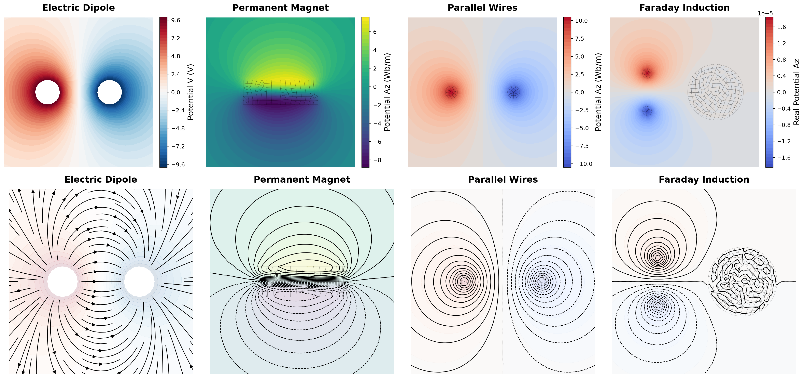
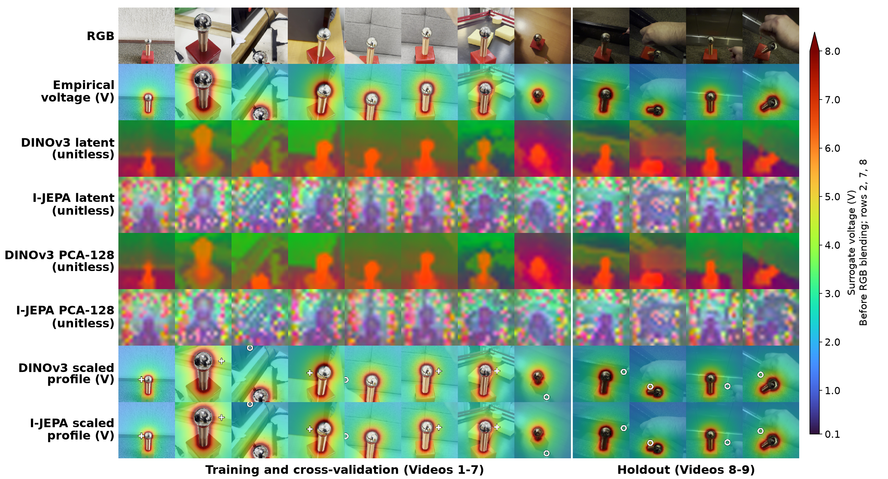

# Physics-AI — CLAGTEE 2026 paper reproduction

**Authors (paper order): Giovanni Cocca-Guardia (first author)**, Gabriel Hermosilla, Hernán Mella, Gabriel Olmos, Manuel Silva, Lisa Soto, and Sebastian Quiñones.

School of Electrical Engineering, Pontificia Universidad Católica de Valparaíso, Chile (all authors except Lisa Soto, School of Computer Engineering). Corresponding author: Gabriel Hermosilla.

[](assets/fig2.png)

[](assets/fig5.png)

Public reproduction repository for **A Physics-AI Framework for Video-Assisted Electric Potential Mapping Using 2D FEM: A Tesla Coil Case Study**. The paper's complete code/data snapshot is [release clagtee-2026-full-v1.0](https://github.com/Templariem/physicsai-clagtee2026-reproduction/releases/tag/clagtee-2026-full-v1.0). [Version 1.0.1](https://github.com/Templariem/physicsai-clagtee2026-reproduction/releases/tag/clagtee-2026-full-v1.0.1) adds licensing and documentation only, with identical scientific files.

This package contains the code, annotated data, meshes and trained adapters needed to reproduce Experiments I–IV and the figures/tables in the revised paper. Pretrained backbone weights are obtained separately from the official sources described below.

## Licenses

The authors' code and software documentation are licensed under [MIT](LICENSE).
The author-owned data and research artifacts are licensed under
[CC BY 4.0](LICENSE-DATA), with attribution to **Giovanni Cocca-Guardia**.
[LICENSING.md](LICENSING.md) specifies the covered paths, application to the
original v1.0 release, and exclusions for the article and its prepared figures.
The pretrained backbones and dependencies retain their own terms; see
[third-party notices](THIRD_PARTY_NOTICES.md). Our licenses do not override
DINOv3's conditions or I-JEPA's noncommercial backbone license.

## Hardware and environment

The paper was run on an **Apple MacBook with M4 Pro and 48 GB unified memory**, using PyTorch **MPS**, FP32 and four CPU threads. Unified memory is not equivalent to dedicated GPU VRAM. The separate CUDA reproduction uses an **NVIDIA RTX 5060 Ti with 16 GB VRAM**; see `validation/REPORT.md` for measured agreement, timings and complete environment records.

Feature extraction, adapter training, evaluation, timing and latent-display commands accept `--device auto`, `--device mps`, `--device cuda` or `--device cpu`. `auto` selects CUDA, then MPS, then CPU according to availability. No source-code edits are needed. CUDA requires an NVIDIA-compatible PyTorch build and driver; changing a string alone cannot supply those dependencies. This reproduction uses FP32 without AMP or TF32. Cross-platform training is not expected to be bitwise identical, even with fixed seeds. FPS is hardware-specific.

## MacBook M4 Pro / RTX 5060 Ti replication

These checks were run on October 4, 2026: MacBook M4 Pro with 48 GB unified memory (macOS, MPS) and the homelab RTX 5060 Ti with 16 GB VRAM (Linux, CUDA). The Linux environment was installed from scratch and passed `pip check`. Full environments, commands and numerical records are in [the validation report](validation/REPORT.md).

| Experiment | MacBook M4 Pro | Linux homelab with RTX 5060 Ti | Comparison scope |
|---|---|---|---|
| I — Analytical verification | 12 cases rerun: three meshes × four regimes | Not rerun in this Linux check | [Mac convergence results](validation/mac_fem/exp_1_convergence_table.csv); no cross-platform claim for this experiment |
| II — Classical electromagnetic benchmarks | Four cases and figure regenerated | Not rerun in this Linux check | Mac execution recorded in [validation commands](validation/commands.md) |
| III — Planar coil prior and LED calibration | Regenerated FEM input matches the archived input exactly | Same mesh; maximum potential difference 3.129e-09 V | [FEM comparison](validation/cuda_fem_comparison.json); both runs use CPU NumPy/SciPy, not GPU acceleration |
| IV — Surrogate prediction and evaluation | Saved-head inference, adapter retraining, vision-only diagnostic and timing on MPS | Fresh-feature inference, adapter retraining, vision-only diagnostic and timing on CUDA | Same 128 development / 36 holdout queries, video folds and five-LED calibration; detailed results below |

**Saved-adapter inference.** The paper adapters, PCA and scalers stay fixed; the backbone features are recomputed in CUDA. Differences below are relative to the archived Mac predictions, over all 36 holdout queries. This is distinct from retraining the adapters.

| Model | Maximum absolute prediction difference, RTX versus archived Mac (V) |
|---|---:|
| Physical | 5.159e-07 |
| DINOv3 | 7.424e-07 |
| I-JEPA | 5.386e-07 |

[Saved-head comparison data](validation/cuda_fresh_features/comparison_to_paper.csv). All differences are below 0.000001 V and preserve the rounded paper metrics.

**Adapter retraining.** Backbones remain frozen. Mac uses the archived Mac feature arrays; CUDA uses newly extracted CUDA features and augmentations. The Mac retraining reproduces the archived metrics. The two vision-only rows retain their separate diagnostic protocol from Table V.

| Model / configuration | Mac R² | RTX R² | Mac MAE (V) | RTX MAE (V) |
|---|---:|---:|---:|---:|
| Physical ensemble | 0.988853 | 0.988544 | 0.061967 | 0.064505 |
| DINOv3 hybrid | 0.988934 | 0.988742 | 0.057821 | 0.059809 |
| I-JEPA hybrid | 0.988488 | 0.988474 | 0.062291 | 0.063521 |
| DINOv3, vision only | -0.237453 | -0.033245 | 0.596260 | 0.590770 |
| I-JEPA, vision only | 0.352197 | 0.320958 | 0.472349 | 0.463138 |

Sources: [Mac hybrids](validation/mac_retrained_cached/holdout_comparison.csv), [CUDA hybrids](validation/cuda_retrained_fresh/holdout_comparison.csv), [Mac vision only](validation/mac_vision_retrained/vision_only_summary.csv), [CUDA vision only](validation/cuda_vision_retrained/vision_only_summary.csv).

These are single executions of the fixed training protocol on each platform, without retuning to the holdout. Seed control does not guarantee identical training across MPS and CUDA; the vision-only differences are larger. This check establishes computational agreement within the differences shown, not independent physical field accuracy or statistical superiority.

**Inference timing.** This is the new replication benchmark; it does not replace the original timings in Table IV of the paper. Five passes per model, five warm-up frames per pass, 36 timed frames per pass, batch size one and explicit device synchronization. Latency is mean ± sample SD of the five pass means.

| Encoder | Mac latency (ms) | Mac FPS | RTX latency (ms) | RTX FPS |
|---|---:|---:|---:|---:|
| DINOv3-S/16 | 12.517 ± 0.322 | 79.89 | 8.688 ± 0.029 | 115.11 |
| I-JEPA-H/14 | 77.208 ± 0.261 | 12.95 | 39.592 ± 0.101 | 25.26 |

Sources: [Mac timing](validation/mac_timing/benchmark_summary.csv), [CUDA timing](validation/cuda_timing/benchmark_summary.csv). The measured path includes preprocessing, transfers, backbone, PCA/scalers and heads; it excludes loading, disk decoding, camera acquisition, geometry extraction, FEM and rendering. Encoders ran one at a time. Another user process occupied about 1.3 GiB on the RTX during this check; it was left running.

## Installation

Use Python 3.14 and a fresh environment:

```sh
python3 -m venv .venv
source .venv/bin/activate
python -m pip install -r requirements.txt
python -m pip check
```

The exact CUDA build and driver actually tested are recorded in `validation/`. If installing on different hardware, obtain the matching PyTorch build from the [official installation selector](https://pytorch.org/get-started/locally/), then install the remaining requirements. Optional mesh generation uses `requirements-mesh.txt`; the exact meshes used in the paper are already supplied.

## Official backbone downloads

Obtain each model under its own official access conditions:

| Encoder | Official repository | Pinned revision |
|---|---|---|
| DINOv3 ViT-S/16 | [facebook/dinov3-vits16-pretrain-lvd1689m](https://huggingface.co/facebook/dinov3-vits16-pretrain-lvd1689m) | `114c1379950215c8b35dfcd4e90a5c251dde0d32` |
| I-JEPA ViT-H/14 | [facebook/ijepa_vith14_1k](https://huggingface.co/facebook/ijepa_vith14_1k) | `f157467ea509bc356ff9f61fd3c0d840eec5e04e` |

DINOv3 is gated: request/accept access on its official page using your own account and satisfy the owner's requirements. I-JEPA's page currently lists CC BY-NC 4.0 and does not present the same access gate. Do not assume approval for one checkpoint covers another. Read the original licenses and model cards. If authentication is required, log in locally; never put tokens into a script, commit or command argument.

```sh
hf auth login
python -m physicsai.download
```

The download command obtains only the two pinned configurations, preprocessors and weight files from the official `facebook` repositories. The Git repository contains the authors' small trained adapters/PCA/scalers, not DINOv3 or I-JEPA weights. Once downloaded, inference can run offline. `HF_HUB_CACHE` can point to your own authorized cache.

## Experiment IV: Surrogate prediction and evaluation

This is the paper's AI experiment: a physical ensemble and a trained visual residual using frozen DINOv3 or I-JEPA features, with a separate vision-only diagnostic. Run commands from the repository root, after the official downloads when fresh backbone inference is required. Use fresh output directory names for new runs. The archived inputs and paper results remain under `data/` and `reference/`.

```sh
# Audit input hashes and geometry, including exclusion of missing-query frames.
python -m physicsai.verify
python -m physicsai.train --device cpu --preflight --output runs/preflight

# Re-evaluate all saved paper heads (holdout, CV and vision-only diagnostic).
# This path needs no backbone download because the original features are included.
python -m physicsai.evaluate --device auto --output runs/saved_evaluation

# Regenerate all clean and augmented features from the 271 images.
python -m physicsai.features --device auto --offline --output runs/features

# Check the saved heads with newly extracted features.
python -m physicsai.evaluate --device auto --features runs/features --output runs/fresh_evaluation

# Train all physical ensembles and sequential visual residuals from scratch.
python -m physicsai.train --device auto --features runs/features --output runs/training

# Reproduce the separate vision-only diagnostic in Table V.
python -m physicsai.vision_only --device auto --features runs/features --output runs/vision_only

# Table IV inference protocol with the final saved paper heads.
python -m physicsai.benchmark --device auto --output runs/timing
```

For a faster inference-only check, `features --clean-only` skips augmentations. Those files cannot be used for training. To isolate adapter training from backbone/platform differences, omit `--features` in the training commands: they then use the archived feature arrays.

Training uses the final fixed protocol in `protocol.json`: three independent physical adapters, 180 epochs, seeds 42–44 in the final refit; PCA-128 fitted within each training fold; four photometric augmentations; sequential 160-epoch residual training with the physical estimate frozen; a fixed 0.25 inference gate. The source contains the architectures, loss functions, learning rates, schedules and seed handling. The vision-only diagnostic uses 14 augmentations and averages five fold models, as disclosed in the paper. There is no need to reconstruct adapters from a separate prose guide.

Five timing passes alternate encoder order. Each pass loads outside timing, warms up on five frames and times 36 synchronized batch-one predictions. The measured path includes RGB preprocessing, transfers, backbone/global/local pooling, PCA/scalers and heads. It excludes model loading, disk decoding, acquisition, geometry extraction, FEM solving and rendering. FPS is 1000 divided by pooled mean latency; the reported SD is the sample SD of the five pass means.

## FEM experiments (I–III) and paper figures

```sh
MPLBACKEND=Agg python fem/exp_1.py
MPLBACKEND=Agg python fem/exp_2.py
MPLBACKEND=Agg python fem/exp_3.py --output-dir runs/fem3 --skip-mesh-plots
python fem/calibration_sensitivity.py --output-dir runs/calibration
python figures/figure1.py
python figures/figure2.py
python -m physicsai.virtual_queries
python -m physicsai.latents --device auto --offline
python figures/render.py
cp runs/figures/exp_2_potentials_and_vector_fields.png assets/fig2.png
cp runs/figures/fig5_shared_voltage_scale.png assets/fig5.png
```

Experiment III regenerates `runs/fem3/exp_3_fem_solution.npz`. Its `nodes`, `elements` and `U_abs` reproduce `data/fem_prior.npz`; the latter is retained as the exact ML input. The formulation is **Cartesian 2D**, with no cylindrical weighting. FEM supplies a spatial prior. The five-LED law supplies scalar targets and empirical decay inputs; the displayed map is a calibrated profile, not an independent electric-field measurement.

Figure 1 uses the analytical reference profiles; the numerical errors and performance tables are produced by Experiment I. Figure 2 is regenerated from the four Experiment II solutions. Figure 3 is the archived [experimental photographic composition](data/figure3_led_setup.png) documenting the setup and LED observations. Figure 4 combines the calibrated FEM contour remapping and the holdout predictions. Figure 5 preserves the image layout, common 0.1–8 V display scale and query markers. Its unitless latent/PCA rows are regenerated from the **actual DINOv3 and I-JEPA checkpoints**; their spatial visualization PCAs are distinct from the predictor PCA. Circles mark annotated probes and crosses mark virtual queries excluded from training/scoring. RGB and voltage arrays were preserved when correcting the historical latent display.

The photograph/layout template in `data/figure5_original.png` is an input asset, not a source of latent/PCA values or regression outputs. The renderer replaces its quantitative and latent rows. Regenerated figures are written under `runs/figures/` for comparison with the archived results.

The two DINOv3 display rows use the author's preferred green/orange/purple palette. `reference/figures/dino_display_palette.json` specifies one fixed affine RGB transform selected from the eight development thumbnails' historical color appearance and applied identically to all columns. This changes display colors only: the official DINOv3 features, spatial PCA projections, I-JEPA rows, voltage profiles, trained heads and reported scores remain unchanged. It does not reinstate the historical DINOv2 features.

## Data and interpretation

The 271 annotated keyframes from nine videos are the complete frame dataset used in the paper; the original continuous videos are not needed by these experiments. The filename-to-video mapping is explicit in `physicsai/core.py`. Frame numbering reaches 272; the one frame without usable sphere annotations is excluded from this package, matching the 271-frame loader and manifest.

The five manual activation measurements are white (5 cm, 3.3 V), blue (6 cm, 3.1 V), green (6.5 cm, 2.5 V), yellow (12 cm, 2.1 V), and red (17 cm, 2.0 V). Distances were observed manually; voltages were estimated by LED color, with 2 cm leg separation. No retained repeats or quantitative threshold uncertainties are available. The fitted curve is `6.019078473682064 * (d / 1 cm)^(-0.40580894137904955) V`. No historical endpoint anchors or default 3.3 V labels are used.

There are 164 valid scalar queries: 128 development frames (Videos 1–7) and 36 holdout frames (Videos 8–9). The remaining 107 frames have no localized probe and retain NaN regression targets. Of the development/holdout queries, 71/15 are within the 5–17 cm calibration interval and 57/21 are extrapolated. `data/regression_annotations.json` and `reference/results/dataset_manifest.csv` expose every inclusion decision. Distances are image-plane proxies: target distance is to the nearest sphere/winding polygon surface; the FEM feature uses sphere-centre distance without adding another sphere radius.

The corrected analysis uses a previously examined holdout. Calibration dependence, one coil setup and the absence of independent field measurements remain scientific limitations. Reproduction verifies the reported computation, not physical measurement fidelity or statistically established encoder superiority.

## Contents and provenance

- `data/`: final images, original and valid-query annotations, FEM input and query policy.
- `fem/`: paper solver, meshes, Experiments I–III and five-LED sensitivity calculation.
- `physicsai/`: paper-only feature extraction, training, evaluation, timing and displays.
- `reference/`: paper features, small trained heads, predictions, folds and original results.
- `figures/`: generators for the reported computational figures.
- `assets/`: unchanged copies of Figures 2 and 5 displayed in this README.
- `validation/`: commands, environments, dependency checks and Mac/CUDA comparisons.
- `MANIFEST.sha256`: SHA-256 checksums used to verify that the data and reference files match this version. Run `python -m physicsai.verify` to check them.

Saved hybrid checkpoints record the hash of [the original training protocol](reference/provenance/original_training_protocol.json). The root `protocol.json` uses the same calibration, geometry, splits and training settings, with package metadata replacing historical run notes. This provenance file allows the recorded training hash to be checked without changing the trained models.

The [final repository audit](validation/final_audit_2026-10-04/README.md) records input verification and a new CPU evaluation of the saved heads against the paper's reported metrics.

The required FEM solver and meshes are already included in `fem/`. Their earlier public version is archived as [release clagtee-2026-v1.0](https://github.com/Templariem/maxwell_solver_fem_2d/releases/tag/clagtee-2026-v1.0); this link documents provenance. The current public package contains the complete FEM/AI experiments and required data. Third-party software and pretrained models retain their own licenses.
